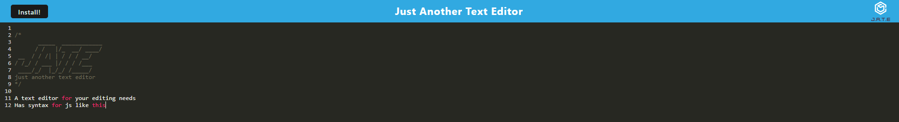

  

  # M19-PWA-Text-Editor

  ## Description
  This project is a text editor that has theming for javascript syntax. It is also a Progressive Web App that can be installed to the computer 
  During this project I learned to:
  
  - Create a noSQL database in MongoDB
  - Run a service worker
  - Add multiple routes to the same function instead of defining them individually
  - Create a manifest with webpack

  ## Table of Contents
  
  1. [Installation](#installation)
  2. [Usage](#usage)
  3. [License](#license)
  4. [Questions](#questions)
  
  ## Installation
  
  This application does not require installation, simply visit https://thawing-ravine-03438.herokuapp.com/ to use it.
  
  If you do wish to install the project itself locally: 
  
  - Clone the repo down to your local machine.
  - If you don't have Node.js, navigate to nodejs.org & download v16.18.0 or newer.
  - Install NPM packages using npm i
  
  
(<a href="#readme-top">back to top</a>)

  ## Usage
  
  Upon visiting, the site should look something like this.
  
  
  
  Once you are on the site, type anything you would like into the text editor, be it code or any notes you wish to keep.
  
  If you wish to install the app to your computer, click the install button in the top left corner.
  
  If you have installed the project locally and followed installation instructions, run `npm run start:dev` in the terminal to build the project's dist folder and visit localhost:3000 in your browser.
  
  
(<a href="#readme-top">back to top</a>)

  ## License
  Copyright (c) [benjamincottrell](https://github.com/benjamincottrell). All rights reserved. 
  
Licensed under the [MIT license](https://choosealicense.com/licenses/mit/).
  
(<a href="#readme-top">back to top</a>)

  ## Questions
  For any questions feel free to contact me via:
  - GitHub: [benjamincottrell](https://github.com/benjamincottrell)
  - Email: [bencottrell48@yahoo.com](mailto:bencottrell48@yahoo.com)
  
(<a href="#readme-top">back to top</a>)

